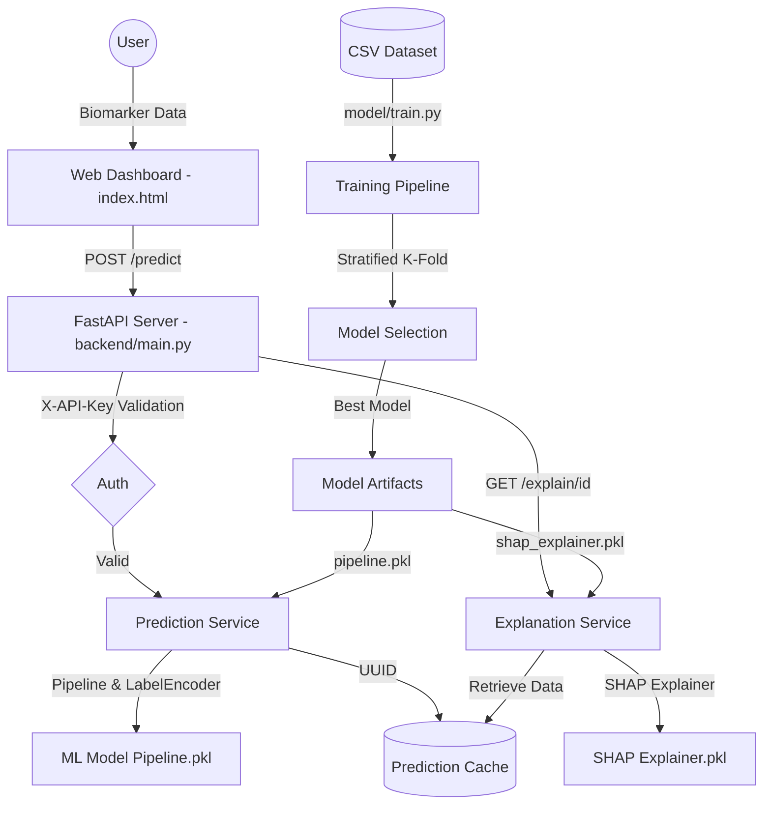

# Cardiac Risk Prediction System Architecture

## System Components

1.  **Frontend**: Static HTML5 dashboard using Chart.js for visualization and real-time monitoring simulations.
2.  **Backend**: FastAPI server providing high-performance endpoints for prediction and explanation.
3.  **ML Model**: Scikit-learn/Imblearn pipeline including `StandardScaler`, `SMOTE`, and a Classifier (e.g., Logistic Regression).
4.  **SHAP Explainer**: Post-hoc model explanation using SHAP values to identify feature importance for specific predictions.
5.  **DevOps**: Dockerized deployment with GitHub Actions for CI/CD.
